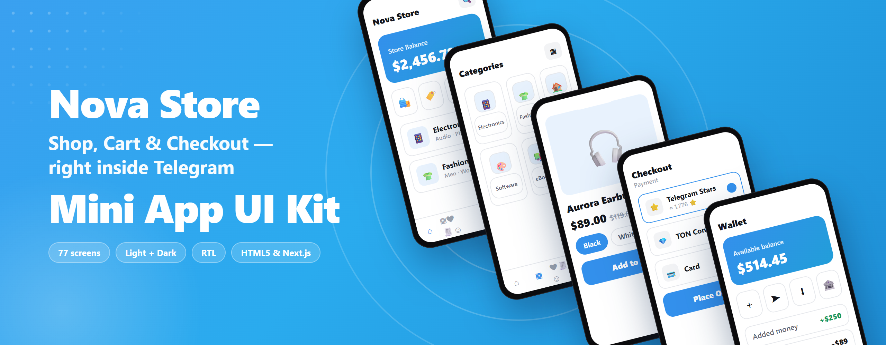
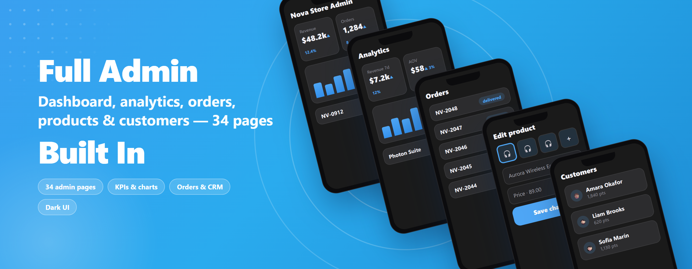

<div align="center">



# Nova Store — Telegram Mini App eCommerce UI Kit

**A complete storefront + admin panel for a Telegram Mini App, in pure HTML5 · CSS3 · vanilla JS.**
No framework. No bundler. No dependencies. Open it in a browser and it runs.

[](https://github.com/unusdon/nova-store-telegram-mini-app)
&nbsp;·&nbsp; Light + Dark &nbsp;·&nbsp; EN · ES · AR (RTL) &nbsp;·&nbsp; Telegram-native

### ⭐ If this saves you time, **star the repo** — it genuinely helps.

**Prefer a typed React stack?** &nbsp;→&nbsp; **[The Next.js 15 + React 19 + TypeScript edition is free here too](https://github.com/unusdon/nova-store-telegram-mini-app-nextjs)** — same design, componentised, with the full 34-page admin.

</div>

---

## What this is

A front-end **UI kit** for a Telegram Mini App store, styled Telegram-native (white + blue, dark on
the toggle). It ships **43 storefront screens + a 34-page admin panel** wired to a `localStorage`
demo layer, so the whole thing is clickable out of the box — you connect your own API and payment
keys for production.

> **It's a front-end kit, not a hosted backend.** Payments run through provider *adapters*
> (Telegram Stars · TON · Stripe · Cash on Delivery) that simulate in demo mode; drop in your own
> endpoints/keys to go live. Honest and simple.

## ✨ Features

- **77 screens total** — 43 storefront + 34-page admin dashboard
- **Config-first** — one `assets/js/config.js` re-skins & re-scopes the whole app (brand, currency, tax/shipping, promo codes, payments, nav, locale)
- **Light + Dark** themes, Telegram-native palette, `data-theme` toggle
- **3 languages** — English · Spanish · Arabic, with full **RTL**
- **Digital + physical products** — downloads, license keys, variants
- **4 payment rails** — Telegram Stars · TON · Stripe · Cash on Delivery (adapter pattern)
- **Full admin** — dashboard, analytics, orders, products, customers, loyalty, discounts, and more
- **Zero build step** — native ES modules; no npm, no toolchain

## ▶ Run it locally

Native ES modules are **blocked on the `file://` protocol**, so open `index.html` through a static
server (double-clicking it shows a friendly "run a server" notice — that's expected):

```bash
python -m http.server 8000      # then visit http://localhost:8000
# — or —
npx serve
# — or use the VS Code "Live Server" extension
```

In production, Telegram Mini Apps must be served over **HTTPS** — upload the folder to any static
host (Netlify, Cloudflare Pages, Vercel, cPanel…) and point your bot's Web App URL at it.

## 🌐 Live demo

**[View the live demo →](https://nova-store-telegram-mini-app.netlify.app)** &nbsp;·&nbsp; [admin dashboard →](https://nova-store-telegram-mini-app.netlify.app/admin/)

<sub>_On desktop it renders as a centred phone; on a real device it fills the screen. Sample data runs in the browser (localStorage) — connect your own API & keys for production._</sub>



## 🛠 Make it yours

Almost everything is controlled from two files:

- **`assets/js/config.js`** — brand, colours, currency, tax/shipping, promo codes, payment methods, feature flags, navigation, default language, and data source.
- **`assets/css/tokens.css`** — the full design-token system (light + dark).

**Theme:** ships **light-first** with a Telegram-blue accent and a light/dark toggle. Set
`config.theme.colorScheme` (`'auto' | 'light' | 'dark'`) or `config.theme.accent` to force one
brand colour across both themes.

**Add a language:** copy `assets/js/i18n/locales/en.js` to `xx.js`, translate, register it in
`assets/js/i18n/index.js`, and add `'xx'` to `config.locale.available` (and `rtlLocales` if RTL).

## 🧩 How it's built

Multi-page app, **one controller class per page** (`products.html` → `js/products.js`), ES6 classes
on `DOMContentLoaded`. State lives entirely in `localStorage` (`cart`, `orders`, `favorites`, …);
pages coordinate by reading/writing those keys. Pages never touch storage directly — they call
`dataService` (`assets/js/core/store.js`), so setting `config.data.source = 'api'` +
`config.data.apiBaseUrl` and implementing the adapter points the whole app at your backend.

## Two editions

Same design, two stacks — pick the one that matches yours. Both are free.

| | **This repo (vanilla)** | **[Next.js edition](https://github.com/unusdon/nova-store-telegram-mini-app-nextjs)** |
|---|---|---|
| Stack | HTML · CSS · vanilla JS | **Next.js 15 · React 19 · TypeScript · Tailwind** |
| Build step | None | Standard Next.js |
| Type safety | — | ✅ Fully typed |
| Architecture | Per-page controllers | Components, hooks, config-first |
| Admin | 34 pages | 34 pages |
| Static export | manual | ✅ `output: 'export'` ready |

**→ [Nova Store — Next.js edition on GitHub](https://github.com/unusdon/nova-store-telegram-mini-app-nextjs)**

## License

See [`LICENSE`](LICENSE). Free to use and build your own store on top of; **redistribution or resale
of this kit (or a derivative) as a template/theme is not permitted.** Building your own
product/store with it is exactly what it's for.

---

<div align="center">
<sub>Built by <b><a href="https://github.com/unusdon">unusdon</a></b> — senior software engineer, 21+ years shipping web, mobile, AI &amp; cloud. &nbsp;·&nbsp; If it helped, leave a ⭐.</sub>
</div>
